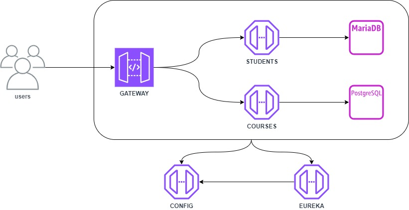

### Build 
- mvn archetype:generate -DgroupId=ksike.sw -DartifactId=ms -DarchetypeArtifactId=maven-archetype-quickstart -DarchetypeVersion=1.4 -DinteractiveMode=false

### Microservices
- [Config](./config/README.md)
- [Eureka](./eureka/README.md)
- [Gateway](./gateway/README.md)

### Commands
- **Start:** docker-compose up -d
- **Stop:** docker-compose down
- **Download dependencies**: mvn dependency:resolve
- **Build without running test**: .\mvnw clean package -DskipTests
- **Start Service db MySql**: docker-compose up -d db_mysql
- **Start Service db PostgreSQL**: docker-compose up -d db_postgres

- **Start Service Config**: docker-compose -f docker-compose.yml up -d srv_config
- **Start Service Eureka**: docker-compose up -d srv_eureka
- **Start Service Gateway**: docker-compose up -d srv_gateway
- **Build Service Gateway**: docker-compose build --no-cache srv_gateway
- **Stop Service Gateway**: docker-compose stop srv_gateway
- **Logs Service Gateway**: docker logs microservices-srv-gateway-1 -f
- **Start Service Student**: docker-compose up -d srv_student

### Servers
- PostgreSQL
    - **username:** admin
    - **password:** admin
    - **hostname:** db_postgres
    - **database:** mydatabase

- MySQL
    - **username:** admin
    - **password:** admin
    - **hostname:** db_mysql
    - **database:** mydatabase

- Adminer
    - **url:** http://localhost:5051

- PgAdmin
    - **url:** http://localhost:5050
    - **username:** admin@example.com
    - **password:** strongpassword

- Eureka
    - **url:** http://localhost:8761
    
- Config
    - **url:** http://localhost:8080
    
- Gateway
    - **url:** http://localhost:9080

- Student
    - **url:** http://localhost:9091

- Course
    - **url:** http://localhost:9090

### Tools
- [Online Spring Boot Banner Generator (with FIGlet Fonts)](https://devops.datenkollektiv.de/banner.txt/index.html)
- [Start Spring](https://start.spring.io/)

### Reference
- [Maven in 5 Minutes](https://maven.apache.org/guides/getting-started/maven-in-five-minutes.html)
- [Configuring Maven](https://maven.apache.org/guides/mini/guide-configuring-maven.html)
- [Downloading Apache Maven 3.9.8](https://maven.apache.org/download.cgi)
- [Spring Boot version 3](https://www.youtube.com/watch?v=t0D4OPcugyI)
- [Spring Boot with Docker](https://spring.io/guides/gs/spring-boot-docker)

