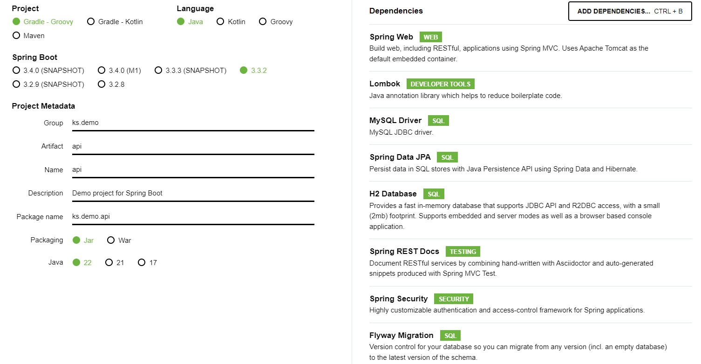

# Getting Started
- [Start Spring](https://start.spring.io/)
- [Security](https://docs.spring.io/spring-boot/docs/1.3.5.RELEASE/reference/html/boot-features-security.html)



### Reference Documentation
For further reference, please consider the following sections:

* [Official Gradle documentation](https://docs.gradle.org)
* [Spring Boot Gradle Plugin Reference Guide](https://docs.spring.io/spring-boot/3.3.2/gradle-plugin)
* [Create an OCI image](https://docs.spring.io/spring-boot/3.3.2/gradle-plugin/packaging-oci-image.html)
* [Spring Web](https://docs.spring.io/spring-boot/docs/3.3.2/reference/htmlsingle/index.html#web)
* [Spring Data JPA](https://docs.spring.io/spring-boot/docs/3.3.2/reference/htmlsingle/index.html#data.sql.jpa-and-spring-data)
* [Spring REST Docs](https://docs.spring.io/spring-restdocs/docs/current/reference/htmlsingle/)
* [Spring Security](https://docs.spring.io/spring-boot/docs/3.3.2/reference/htmlsingle/index.html#web.security)
* [Flyway Migration](https://docs.spring.io/spring-boot/docs/3.3.2/reference/htmlsingle/index.html#howto.data-initialization.migration-tool.flyway)

### Guides
The following guides illustrate how to use some features concretely:

* [Building a RESTful Web Service](https://spring.io/guides/gs/rest-service/)
* [Serving Web Content with Spring MVC](https://spring.io/guides/gs/serving-web-content/)
* [Building REST services with Spring](https://spring.io/guides/tutorials/rest/)
* [Accessing data with MySQL](https://spring.io/guides/gs/accessing-data-mysql/)
* [Accessing Data with JPA](https://spring.io/guides/gs/accessing-data-jpa/)
* [Securing a Web Application](https://spring.io/guides/gs/securing-web/)
* [Spring Boot and OAuth2](https://spring.io/guides/tutorials/spring-boot-oauth2/)
* [Authenticating a User with LDAP](https://spring.io/guides/gs/authenticating-ldap/)

### Additional Links
These additional references should also help you:

* [Gradle Build Scans – insights for your project's build](https://scans.gradle.com#gradle)

### Basic Commands 
- Install dependencies: ```.\gradlew build```
- Compile: ```.\gradlew compileJava```
- Run: ```.\gradlew bootRun```
- Test: ```.\gradlew test```

### Other Commands 
- Run with port:```./gradlew bootRun --args='--server.port=8081'```
- Run from Java: ```java -jar build\libs\api-0.0.1-SNAPSHOT.jar --server.port=8081```
- Running Specific Tests: ```.\gradlew test --tests="com.example.MyTestClass"```

